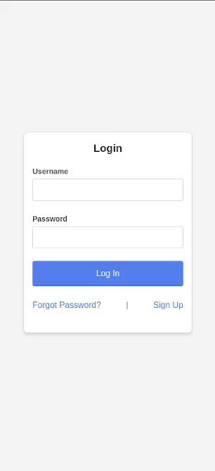

# React Login Form

Welcome to React Login Form, a simple mobile login form built with React, TypeScript, and Tailwind CSS.


## Table of Contents

- [React Login Form](#react-login-form)
  - [Table of Contents](#table-of-contents)
  - [Demo](#demo)
  - [Features](#features)
  - [Getting Started](#getting-started)
    - [Prerequisites](#prerequisites)
    - [Installation](#installation)
    - [Usage](#usage)
  - [Built With](#built-with)

## Demo



## Features

- Basic mobile login form
- React components for easy customization
- TypeScript for static typing
- Tailwind CSS for styling

## Getting Started

### Prerequisites

Make sure you have Node.js and npm installed on your machine.

- Node.js: [Download](https://nodejs.org/)
- npm: [Download](https://www.npmjs.com/get-npm)

### Installation

1. Clone the repository:

   ```bash
   git clone https://github.com/NicholasIliev/ReactLoginForm.git
   ```
2. Navigate to the project directory:

   ```bash
   cd ReactLoginForm
   ```
2. Navigate to the project directory:

   ```bash
   npm install
   ```

### Usage

1. Run the application:

   ```bash
   npm start
   ```

2. Viewing on Mobile:

- Open Developer Tools: Right-click anywhere on the webpage and select "Inspect" or "Inspect Element," or press `Ctrl+Shift+I` (Windows/Linux) or `Cmd+Opt+I` (Mac).
- Toggle Device Toolbar: Look for a device icon or press `Ctrl+Shift+M` (Windows/Linux) or `Cmd+Opt+M` (Mac).
- Select a Mobile Device: Choose a mobile device from the device toolbar.
- Refresh the Page: Refresh the page to apply the mobile view.
- Interact with the Mobile View: Interact with the React Login Form as if you were using a mobile device.


## Built With

- **[React](#react)** - JavaScript library for building user interfaces.
- **[TypeScript](#typescript)** - Superset of JavaScript with static typing.
- **[Tailwind CSS](#tailwind-css)** - CSS framework for rapid UI development.
